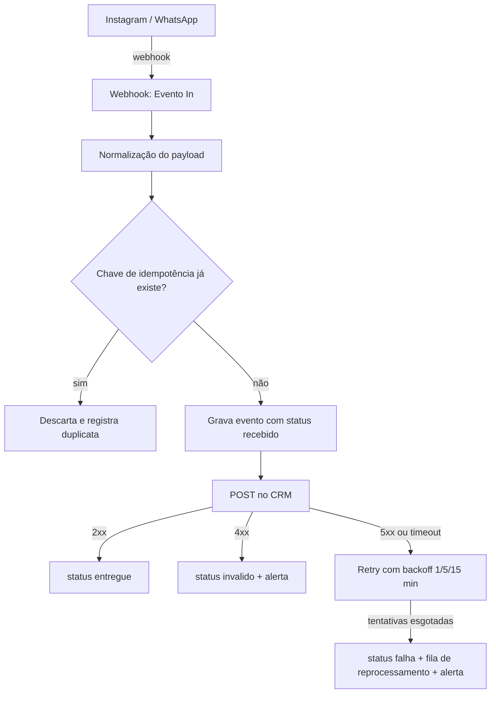

# Ponte de Eventos -> CRM (n8n)

Camada de integração que recebe eventos de Instagram e WhatsApp e entrega cada um deles no CRM **uma única vez**, sem perda silenciosa.

O problema que este projeto resolve não é "conectar duas APIs" — isso um webhook simples resolve. O problema é o que acontece quando a rede oscila, quando a origem reenvia o mesmo evento três vezes, quando o CRM devolve 500 ou quando o payload chega com um campo obrigatório faltando. Sem tratamento, o resultado é sempre um dos dois: lead duplicado no funil ou lead perdido sem ninguém perceber.

---

## Garantias do contrato

| Risco real | Como a ponte trata |
| --- | --- |
| Evento reenviado pela origem | Chave de idempotência determinística; o segundo envio é descartado e registrado como duplicata |
| CRM fora do ar (5xx / timeout) | Retry com backoff progressivo: 1 min, 5 min, 15 min |
| Retry esgotado | Status `falha`, evento vai para a fila de reprocessamento e dispara alerta |
| Campo obrigatório ausente | Status `invalido`, payload gravado integralmente para auditoria, alerta enviado, CRM não é chamado |
| Falha silenciosa | Todo evento termina em um status final explícito; nada fica sem desfecho |
| Necessidade de reprocessar | Runbook documentado em `docs/runbook-reprocessamento.md` |

## Arquitetura



## Chave de idempotência

A chave é calculada na normalização, antes de qualquer escrita:

```
chave = sha256( canal + ":" + id_externo_do_evento )
```

Quando a origem não fornece um identificador de evento — acontece em parte dos webhooks do Instagram — a ponte usa uma chave derivada estável:

```
chave = sha256( canal + ":" + remetente + ":" + timestamp_truncado_ao_minuto + ":" + sha256(texto) )
```

A chave tem restrição de unicidade na tabela de eventos. A verificação acontece **antes** da chamada ao CRM, e a gravação do evento acontece **antes** da entrega. Nessa ordem, uma queda no meio do caminho deixa o evento recuperável em vez de invisível.

## Retry e fila de reprocessamento

- `5xx` e timeout são tratados como falha transitória: reagenda com backoff de 1 min, 5 min e 15 min.
- `4xx` é falha permanente: não faz retry, porque repetir não muda o resultado. Marca `invalido` e alerta.
- Depois da terceira tentativa: status `falha`, o registro mantém o payload original e o último erro, e o evento entra na fila de reprocessamento manual.
- O contador de tentativas fica no próprio registro, então reiniciar o n8n não zera o histórico.

## Alertas

Um único nó de notificação centraliza os três casos que exigem olho humano: payload inválido, retry esgotado e volume anormal de duplicatas (sinal de loop na origem). A mensagem traz canal, chave de idempotência, status e último erro — o suficiente para decidir sem abrir o n8n.

## Estrutura do repositório

```
fluxo/
  ponte-eventos-crm.json         fluxo n8n pronto para importar
docs/
  esquema-tabela-eventos.md      campos, tipos e índices da tabela de eventos
  runbook-reprocessamento.md     como reprocessar a fila de falhas
testes/
  01-evento-valido.json
  02-evento-duplicado.json
  03-campo-obrigatorio-ausente.json
  04-crm-indisponivel.json
  05-payload-malformado.json
```

## Como rodar

1. Suba o n8n com Docker:

```
docker run -d --name n8n --restart unless-stopped -p 5678:5678 -v n8n_data:/home/node/.n8n docker.n8n.io/n8nio/n8n:2.32.7
```

2. Importe `fluxo/ponte-eventos-crm.json` em **Workflows -> Import from File**.
3. Crie a Data Table de eventos conforme `docs/esquema-tabela-eventos.md`.
4. Configure a credencial HTTP do CRM de destino. **As credenciais e chaves de API são sempre do cliente** — nenhum segredo vive neste repositório.
5. Ative o fluxo e envie os payloads de `testes/` para a URL do webhook.

## Cenários de teste

| Cenário | Payload | Resultado esperado |
| --- | --- | --- |
| Evento válido | `01-evento-valido.json` | Gravado, entregue ao CRM, status `entregue` |
| Mesmo evento reenviado | `02-evento-duplicado.json` | Nenhuma segunda escrita no CRM, status `duplicado` |
| Campo obrigatório ausente | `03-campo-obrigatorio-ausente.json` | Status `invalido` + alerta, CRM não é chamado |
| CRM indisponível | `04-crm-indisponivel.json` | Três tentativas com backoff, depois `falha` + fila + alerta |
| Payload malformado | `05-payload-malformado.json` | Rejeitado na normalização, nada é entregue |

## Limitações e escopo

- A entrega é feita em um endpoint HTTP genérico de CRM. Adaptar para um CRM específico é trocar um nó, não reescrever a ponte.
- O backoff de 1/5/15 min é o padrão e deve ser ajustado ao SLA do CRM de destino.
- A ponte não interpreta nem responde mensagens: ela garante a entrega do evento. A camada de atendimento com IA é outro projeto.
- O reprocessamento é manual por decisão de projeto: reprocessar automaticamente uma falha permanente só multiplica o problema.

---

## English summary

Reliable event bridge between Instagram/WhatsApp webhooks and a CRM, built on n8n. It guarantees at-most-once delivery through a deterministic idempotency key, retries transient CRM failures with progressive backoff (1/5/15 min), does not retry permanent failures, and routes exhausted events to a manual reprocessing queue with alerting. Every event ends in an explicit final state, so nothing fails silently. The repository ships the importable workflow, the event table schema, a reprocessing runbook and five end-to-end test payloads.

## Licença

MIT — ver `LICENSE`.
